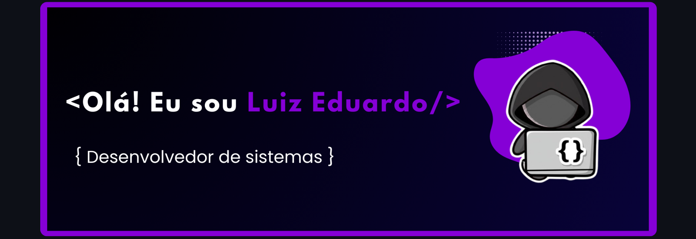

 

    
    
    

 

    
Desenvolvedor web front-end, com conhecimento em HTML, CSS, JavaScript, React e NodeJS, e pretendo cultivar conhecimentos em diversas linguagens e frameworks. Atualmente, Estou cursando Técnico em Análise e Desenvolvimento de Sistemas, tenho 20 Anos e moro em Teresina, Píaui

    

#### Linguagens

---

#### Ferramentas

---

#### Frameworks/ Bibliotecas

---

#### Backend

---

#### Banco de dados

---

#### Hospedagem

 

---

### 🧠 Github Status
 

    

        
        
    

## Agradeço a sua visita!! 👌😁
